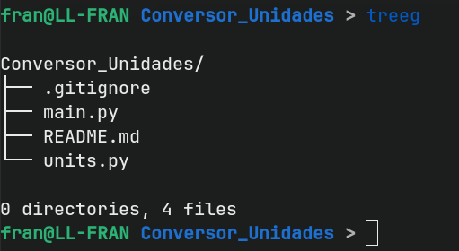

# 🌳 Git-Tree Ignore

A smart Bash script that generates a clean directory tree, automatically filtering out "junk" or ignored files by respecting your native `.gitignore` logic.

Perfect for generating project documentation, `README` structures, or simply visualizing your project layout without the noise of folders like `node_modules`, `__pycache__`, `venv`, etc.

## ✨ Features

- **Native Git Integration:** If you are inside a repository, it uses `git ls-files` to respect your exact ignore rules (including negations `!`, wildcards `**`, etc.).
- **Fallback Mode (Non-Git):** If used outside a repository, it attempts to read a local `.gitignore` and hides `.git` folders and system/hidden files (`.*`) by default.
- **Portability:** Works on Linux and macOS without depending on complex dependencies (does not require `realpath`).
- **Flexible:** Accepts standard arguments from the original `tree` command (such as `-L 2`, `-d`, etc.).

## 📋 Prerequisites

To ensure the core functionality (Git integration) works correctly, you need:

- **Git** (installed on the system)
- **Tree v1.8.0 or higher**
  - *Why?* This script uses the `--fromfile` flag, which was introduced in version 1.8.0.
  - *Check version:* `tree --version`

### Installing Dependencies

**Debian/Ubuntu:**
```bash
sudo apt install tree git

```

**macOS (Homebrew):**

```bash
brew install tree git

```

## 🚀 Installation & Usage

You can download the script and run it directly, but it is highly recommended to install it as a system command for easy access.

### 1. Clone the repository

First, download the code to your machine:

```bash
git clone https://github.com/Zobercito/tree-gitignore.git
cd tree-gitignore

```

### 2. Install as `treeg` (Recommended)

This creates a symbolic link so you can invoke the script by simply typing `treeg` in your terminal from any folder.

Make the script executable:

```bash
chmod +x tree_gitignore.sh

```

Create the symbolic link:

```bash
# This links the script from the current folder to your bin directory
sudo ln -s "$(pwd)/tree_gitignore.sh" /usr/local/bin/treeg

```

> **Note:** If you move the repository folder later, you will need to recreate the link.

## Basic Usage

Run it inside your project folder:

```bash
treeg

```

<p align="center">

</p>

## Advanced Usage

You can pass specific paths and any flag accepted by the original `tree` command:

```bash
# View the tree of another directory
treeg /path/to/another/project

# Limit depth to 2 levels (great for READMEs)
treeg -L 2

# Show only directories
treeg -d

```

## ⚙️ How it works

* **Detection:** The script checks if the current directory is part of a Git "Work Tree".
* **If inside Git:** It executes `git ls-files` to get the exact list of files Git is tracking (plus non-ignored untracked files) and passes this list to `tree` to render. This guarantees 100% accuracy with your `.gitignore`.
* **If NOT inside Git:** It switches to a manual mode where it looks for a local `.gitignore`, converts basic rules so `tree` can understand them, and automatically filters out the `.git` folder and hidden files (`.*`).

## 📄 License

This project is licensed under the MIT License - feel free to use and modify it.